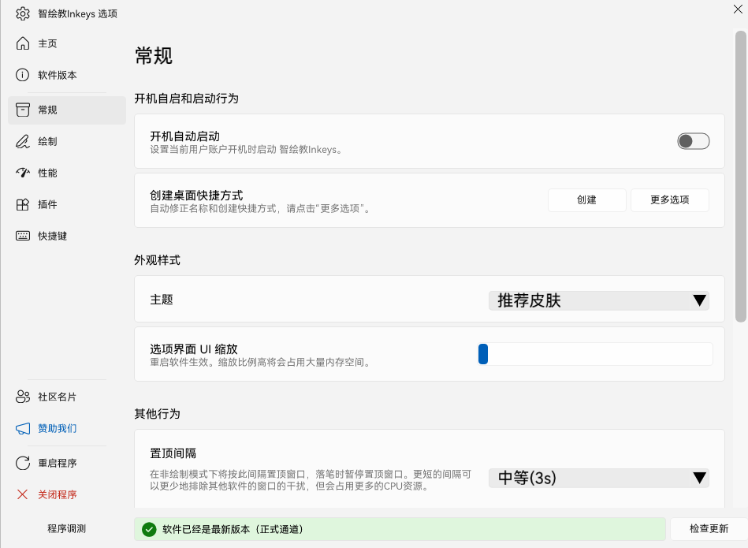
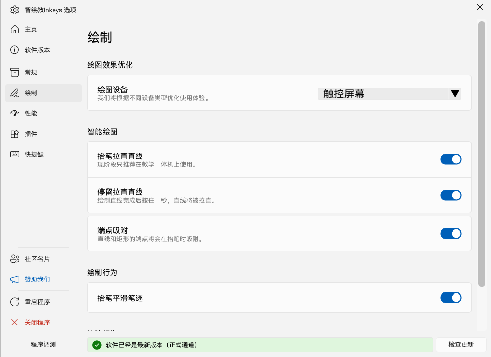
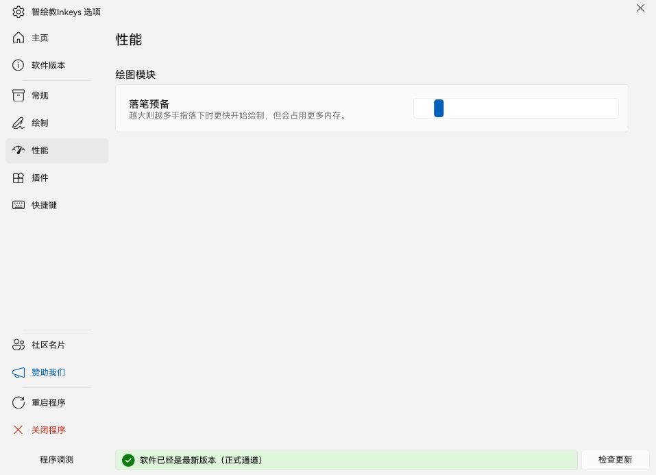

            

原名 `Intelligent-Drawing-Teaching（简称 IDT）`，Windows 屏幕批注工具，拥有批注高效和功能丰富等特点，适用于触摸设备和PC端。

***让屏幕演示变得简单，让教学授课变得高效！***

GitHub仓库：[https://github.com/Alan-CRL/Inkeys](https://github.com/Alan-CRL/Inkeys)

<SiteInfo
  name="智绘教Inkeys 官网"
  desc="使用 VitePress 搭建"
  url="https://www.inkeys.top/"
  logo="https://raw.githubusercontent.com/Alan-CRL/Inkeys/main/GithubRes/logo.png"
  repo="https://github.com/Alan-CRL/Inkeys"
  preview="images/inkeys.png"
/>

<BiliBili bvid="BV1Tz421z72e" />

## 功能

::: tabs

@tab 常规

@tab 绘制

@tab 性能

@tab 插件

:::

- 动态画板背景、窗口定格与穿透
- 智能绘图模块
  - 智能直线绘制/直线吸附/矩形吸附/平滑笔迹/智能粗细橡皮擦
- 炫彩全 RGBA 绘图，1-500 粗细调节
- 全新 UI 与可打断动画
- PPT 联动
  - 翻页/笔迹保留/插件
- 标准笔迹/荧光笔迹
- 撤回和历史画板恢复
- 画板绘制内容自动保存本地
- 随机点名插件
- 支持多指绘制以及模拟笔锋(均未完善)
- 可根据电脑环境自动选择 `RTS 触控库`或`鼠标位置 `作为绘制输入

## 未来目标功能
- 快捷键
- 实时手抖修正（-> 模拟笔锋 -> 模拟压感 -> 笔触压感）
- UI 3.0
  - 全新操作逻辑、界面以及更多的自定义功能，界面缩放与自定义按键
- 全屏白、黑板
- 激光笔
- 自定皮肤模块
- 插件模块（暂定计时器和随机点名）
- 贴图镜
- 历史画板恢复
- 图层
