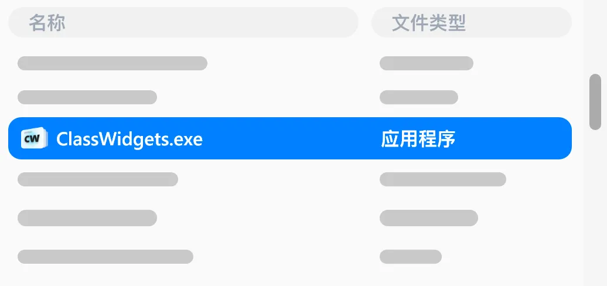

## 确认系统需求

首先，确认您的设备是否满足以下需求：

::: info
在最新的测试版本（1.1.7-Beta4）之后，软件已迁移至PyQt5，现已全面支持Windows7。
:::

- <Badge text="操作系统" type="info" vertical="middle" />	Windows 7 及以上
- <Badge text="运行内存" type="tip" vertical="middle" />	≥ 4 GB
- <Badge text="运行环境" type="note" vertical="middle" />	无特殊要求

若已满足，请进行接下来的步骤。

## 下载 Class Widgets

您可在此应用 GitHub 仓库的 Release 页面中下载最新的 Class Widgets

⬇️ GitHub ：

| 📃 正式版   | 🚧 测试版   |
| - | - |
| [Latest](https://github.com/RinLit-233-shiroko/Class-Widgets/releases/latest) | [Releases](https://github.com/RinLit-233-shiroko/Class-Widgets/releases) |

若您无法从 GitHub 下载，也可从国内的网盘下载

⬇️ 123 网盘：

| [123 网盘镜像](https://www.123pan.com/s/DCyBTd-RAnxH?) | 密码：RL23 |
| - | - |

## 解压和运行

下载完成后，将软件解压到一个独立的文件夹，然后在解压后的文件夹找到 `ClassWidgets.exe` 或 `ClassWidgets` 即可运行。

::: warning
解压时请不要使用“在线解压”功能、尽量不要直接解压在“下载”文件夹或其他功能不单一的文件夹中，否则可能会出现无法预知的问题。

请放到单独的文件夹中（如： `文档\ClassWidgets` ）
:::

## 升级 Class Widgets

若您的计算机中已经安装了旧版本的 Class Widgets，您仅需将新版的压缩包的全部内容覆盖至原安装路径即可。
