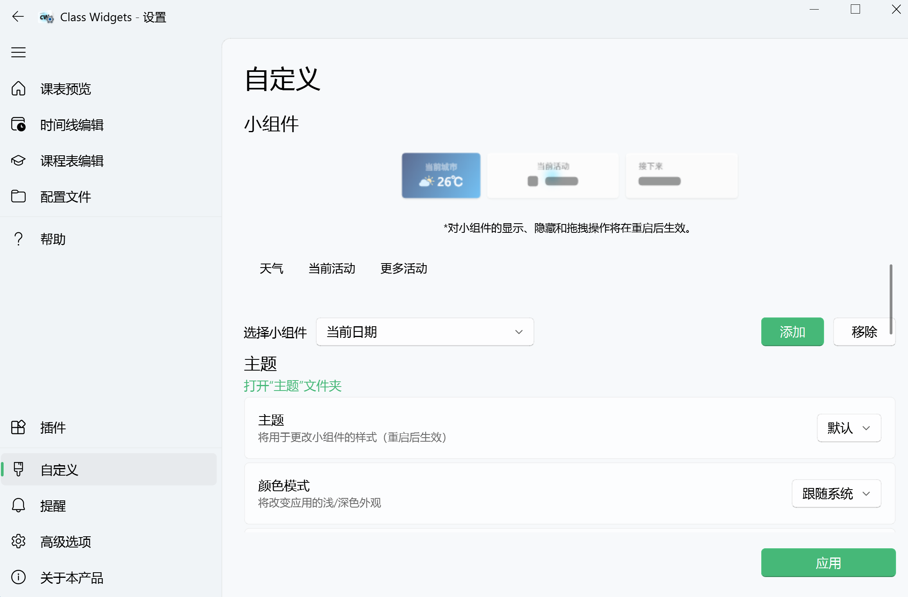
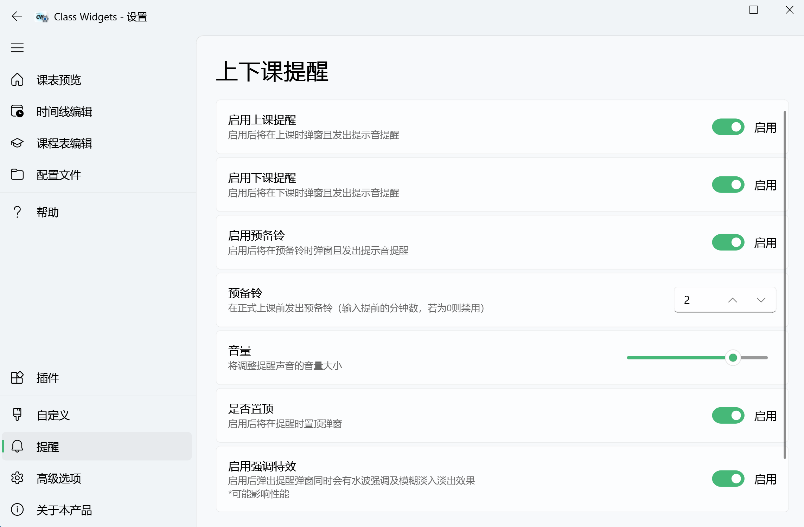
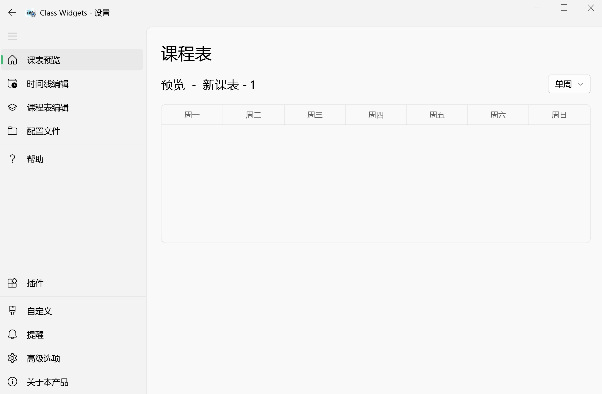
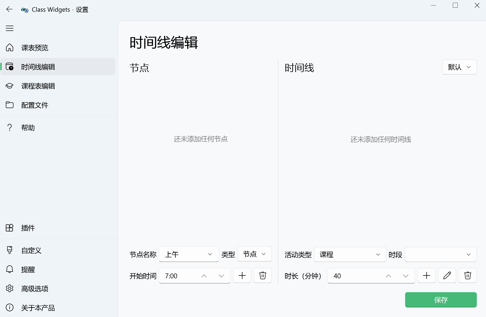
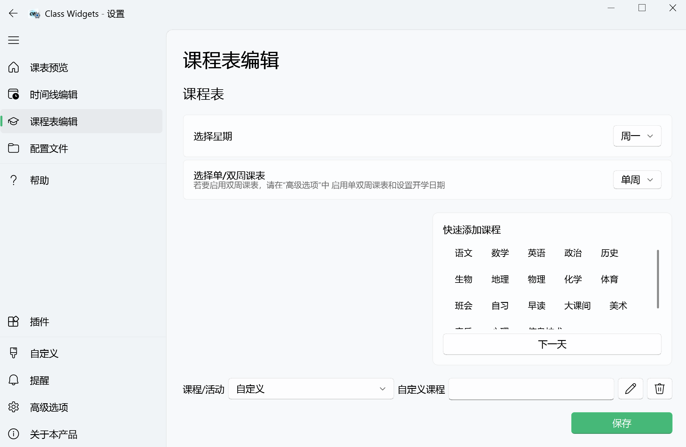
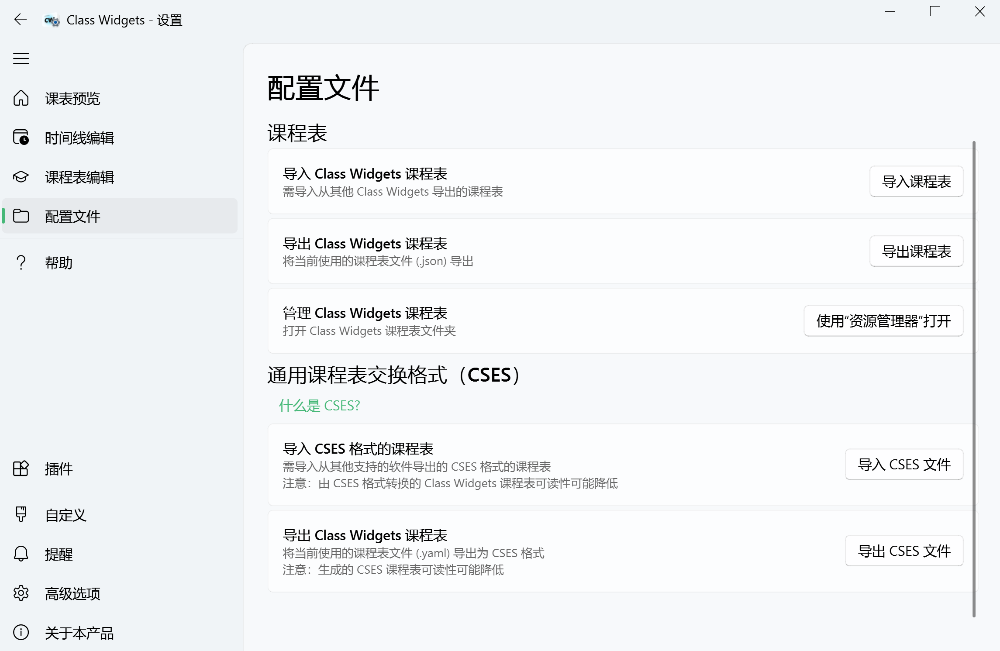
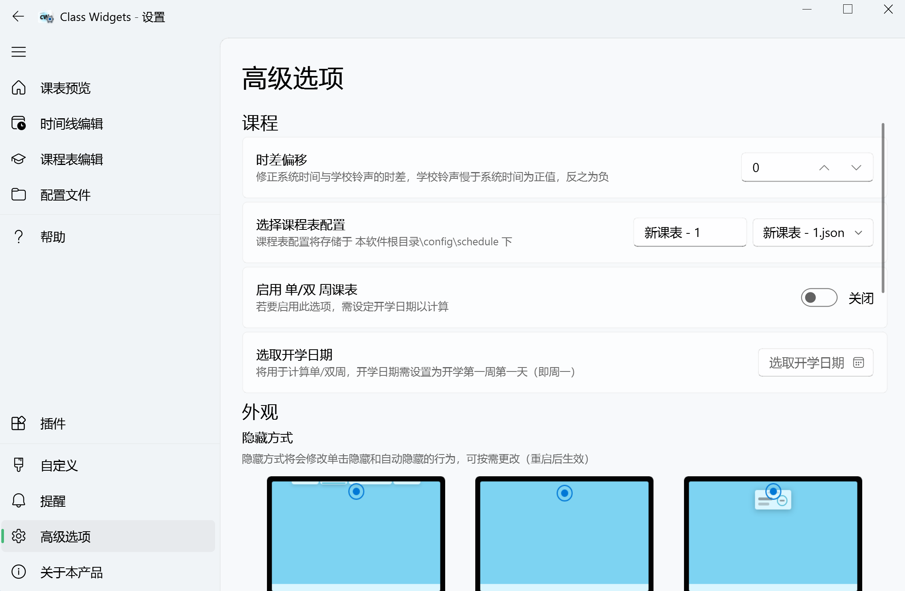
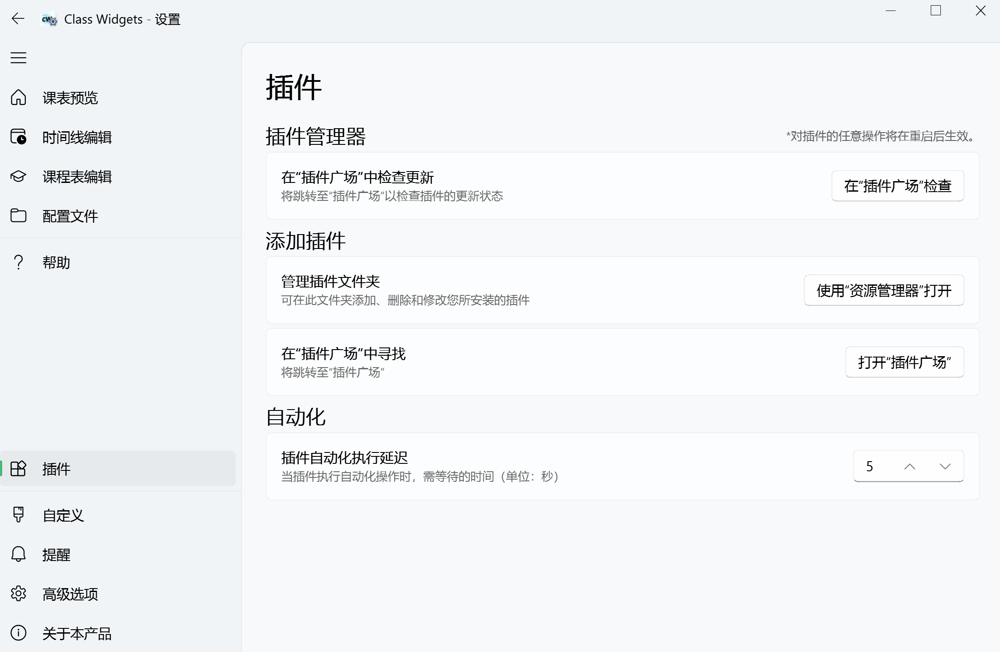
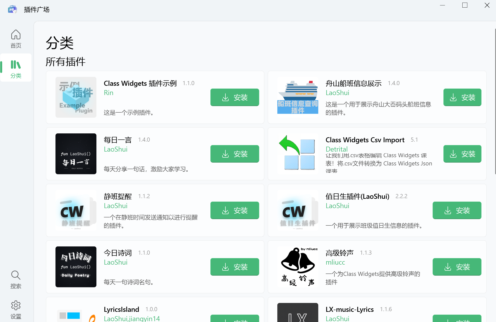

               

一款全新课表软件｜[使用文档](https://classwidgets.rinlit.cn/docs-user)

GitHub仓库：[https://github.com/Class-Widgets/Class-Widgets](https://github.com/Class-Widgets/Class-Widgets)

<SiteInfo
  name="Class-Widgets 官网"
  desc="全新桌面课表"
  url="https://classwidgets.rinlit.cn/"
  logo="https://raw.githubusercontent.com/Class-Widgets/Class-Widgets/main/img/Logo.png"
  repo="https://github.com/Class-Widgets/Class-Widgets"
  preview="https://classwidgets.rinlit.cn/assets/img/banner.png"
/>

<BiliBili bvid="BV1SSfDYmEa4" />

<BiliBili bvid="BV1xwW9eyEGu" />
## 主界面

## 小组件
以小组件形式显示：
- 当前活动结束剩余时间、当前活动、接下来课程
- 天气、倒数日、每日一言
- [个性化](https://www.yuque.com/rinlit/class-widgets_help/qyly70ht1ogge1pi)主题设置，支持浅色/深色模式
  
## 提醒
- [上下课提醒](https://www.yuque.com/rinlit/class-widgets_help/fv2ou1i1ngap0hrl)、预备铃和强调特效
  

## [课表编辑](https://www.yuque.com/rinlit/class-widgets_help/oozelh8r56tmw0xb)

::: tabs

@tab 课表预览

@tab 时间线编辑

@tab 课程表编辑

:::

- 导入/导出课程表配置文件
  
- 支持 CSES 格式配置文件

## 更多功能
- [快捷调休/换课](https://www.yuque.com/rinlit/class-widgets_help/gc4epffu7g5bf9os)
- 高级选项

## 插件
- 提供基于 Python 的插件系统，内置 `插件广场` ，便于安装插件以及个性化主题
  
  
  

## 近乎完美的兼容性
兼容 Windows、Linux、macOS 三大主流操作系统
  
::: tabs

@tab Windows 11

    
@tab Windows 7

@tab Linux

:::