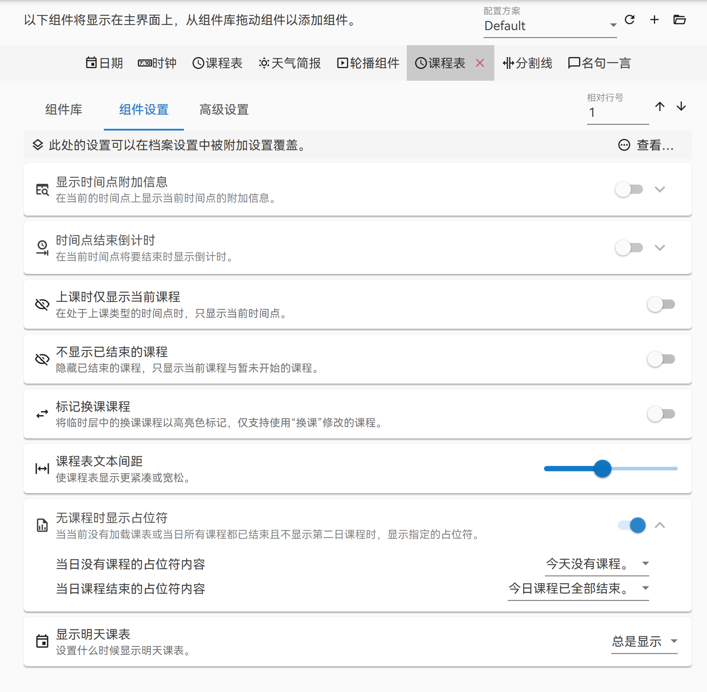
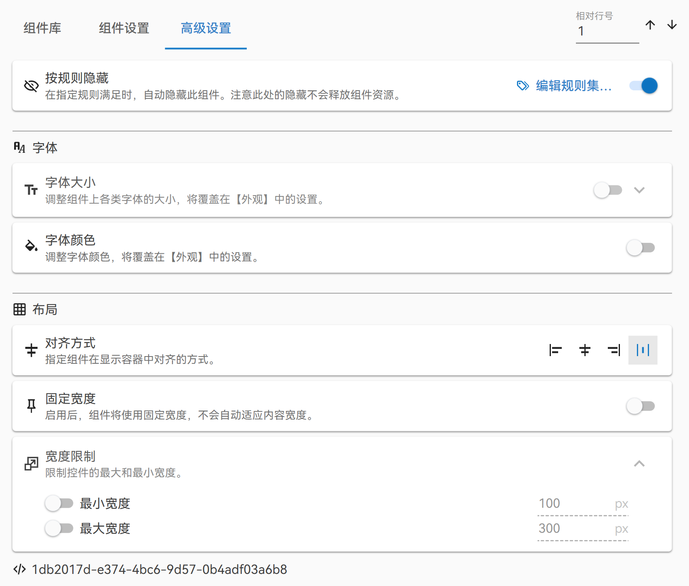
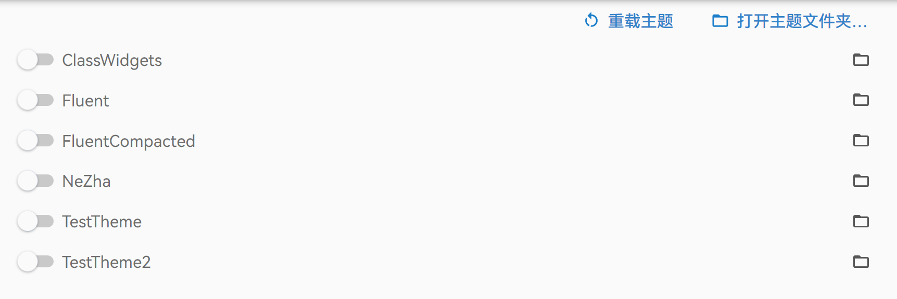
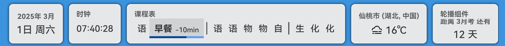
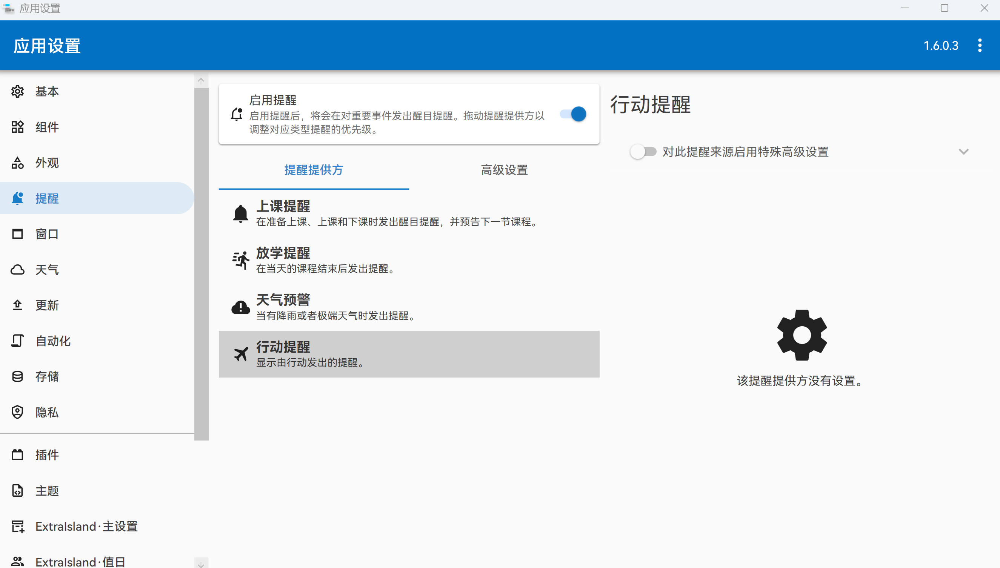
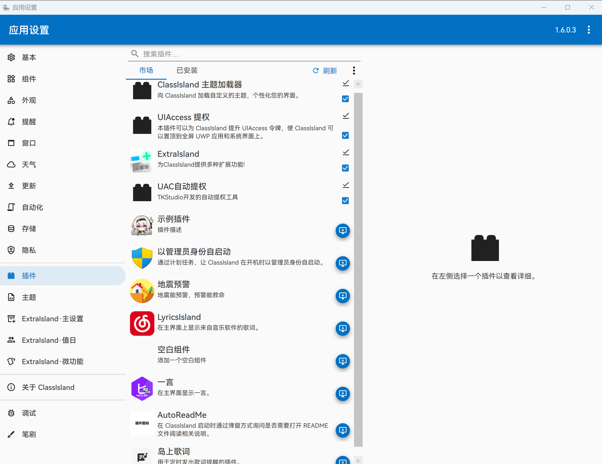
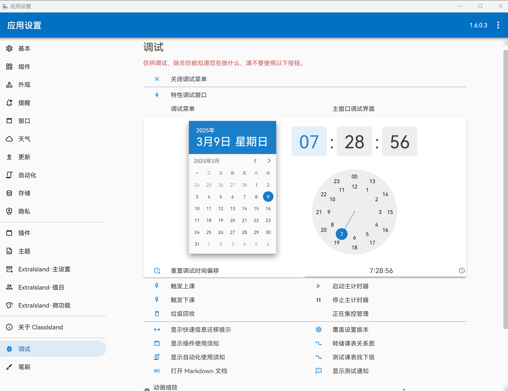
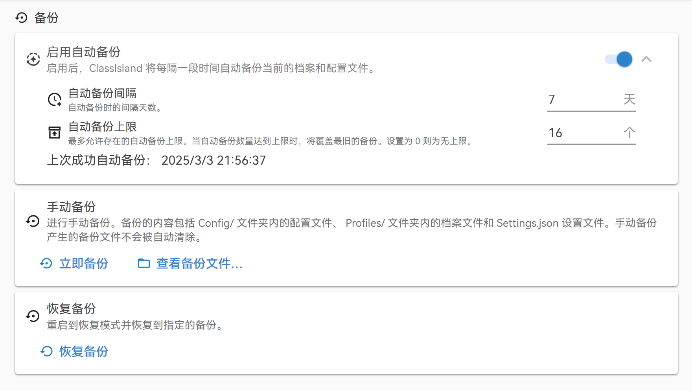

          ![C#](https://img.shields.io/badge/C%23-blue?logo=data:image/svg+xml;base64,PHN2ZyBoZWlnaHQ9IjI4OCIgcHJlc2VydmVBc3BlY3RSYXRpbz0ieE1pZFlNaWQiIHZpZXdCb3g9IjAgMCAyNTYgMjg4IiB3aWR0aD0iMjU2IiB4bWxucz0iaHR0cDovL3d3dy53My5vcmcvMjAwMC9zdmciPjxwYXRoIGQ9Im0yNTUuNTY5IDg0LjQ1MjM3NmMtLjAwMi00LjgzLTEuMDM1LTkuMDk4LTMuMTI0LTEyLjc2MS0yLjA1Mi0zLjYwMi01LjEyNS02LjYyMS05LjI0Ny05LjAwOC0zNC4wMjUtMTkuNjE5LTY4LjA4My0zOS4xNzgtMTAyLjA5Ny01OC44MTY5OTk5NS05LjE3LTUuMjk0LTE4LjA2MS01LjEwMS0yNy4xNjMuMjY5LTEzLjU0MyA3Ljk4Njk5OTk1LTgxLjM0OCA0Ni44MzM5OTk5NS0xMDEuNTUzIDU4LjUzNjk5OTk1LTguMzIxIDQuODE3LTEyLjM3IDEyLjE4OS0xMi4zNzIgMjEuNzcxLS4wMTMgMzkuNDU1IDAgNzguOTA5LS4wMTMgMTE4LjM2NSAwIDQuNzI0Ljk5MSA4LjkwOSAyLjk4OCAxMi41MTcgMi4wNTMgMy43MTEgNS4xNjkgNi44MTMgOS4zODYgOS4yNTQgMjAuMjA2IDExLjcwMyA4OC4wMiA1MC41NDcgMTAxLjU2IDU4LjUzNiA5LjEwNiA1LjM3MyAxNy45OTcgNS41NjUgMjcuMTcuMjY5IDM0LjAxNS0xOS42NCA2OC4wNzUtMzkuMTk4IDEwMi4xMDUtNTguODE3IDQuMjE3LTIuNDQgNy4zMzMtNS41NDQgOS4zODYtOS4yNTIgMS45OTQtMy42MDggMi45ODctNy43OTMgMi45ODctMTIuNTE4IDAgMCAwLTc4Ljg4OS0uMDEzLTExOC4zNDUiIGZpbGw9IiNhMTc5ZGMiLz48cGF0aCBkPSJtMTI4LjE4MiAxNDMuMjQxMzc2LTEyNS4xOTQgNzIuMDg0YzIuMDUzIDMuNzExIDUuMTY5IDYuODEzIDkuMzg2IDkuMjU0IDIwLjIwNiAxMS43MDMgODguMDIgNTAuNTQ3IDEwMS41NiA1OC41MzYgOS4xMDYgNS4zNzMgMTcuOTk3IDUuNTY1IDI3LjE3LjI2OSAzNC4wMTUtMTkuNjQgNjguMDc1LTM5LjE5OCAxMDIuMTA1LTU4LjgxNyA0LjIxNy0yLjQ0IDcuMzMzLTUuNTQ0IDkuMzg2LTkuMjUyeiIgZmlsbD0iIzI4MDA2OCIvPjxwYXRoIGQ9Im0yNTUuNTY5IDg0LjQ1MjM3NmMtLjAwMi00LjgzLTEuMDM1LTkuMDk4LTMuMTI0LTEyLjc2MWwtMTI0LjI2MyA3MS41NSAxMjQuNDEzIDcyLjA3NGMxLjk5NC0zLjYwOCAyLjk4NS03Ljc5MyAyLjk4Ny0xMi41MTggMCAwIDAtNzguODg5LS4wMTMtMTE4LjM0NSIgZmlsbD0iIzM5MDA5MSIvPjxnIGZpbGw9IiNmZmYiPjxwYXRoIGQ9Im0yMDEuODkyMzI2IDExNi4yOTQwMDh2MTMuNDczNjg0aDEzLjQ3MzY4NHYtMTMuNDczNjg0aDYuNzM2ODQydjEzLjQ3MzY4NGgxMy40NzM2ODV2Ni43MzY4NDJoLTEzLjQ3MzY4NXYxMy40NzM2ODRoMTMuNDczNjg1djYuNzM2ODQyaC0xMy40NzM2ODV2MTMuNDczNjg0aC02LjczNjg0MnYtMTMuNDczNjg0aC0xMy40NzM2ODR2MTMuNDczNjg0aC02LjczNjg0MnYtMTMuNDczNjg0aC0xMy40NzM2ODR2LTYuNzM2ODQyaDEzLjQ3MzY4NHYtMTMuNDczNjg0aC0xMy40NzM2ODR2LTYuNzM2ODQyaDEzLjQ3MzY4NHYtMTMuNDczNjg0em0xMy40NzM2ODQgMjAuMjEwNTI2aC0xMy40NzM2ODR2MTMuNDczNjg0aDEzLjQ3MzY4NHoiLz48cGF0aCBkPSJtMTI4LjQ1Njc1MiA0OC42MjU4NzZjMzUuMTQzNzcxIDAgNjUuODI3MTMzIDE5LjA4NjI5ODEgODIuMjYxODEgNDcuNDU2MDY3NWwtLjE2MDM3LS4yNzMwNjc1LTQxLjM0ODU3NyAyMy44MDgyODNjLTguMTQ2NjU2LTEzLjc5MzYwNS0yMy4wODE0NzktMjMuMTAyMDg3My00MC4yMTMyMzItMjMuMjkzNzg2OGwtLjUzOTYzMS0uMDAzMDE3OGMtMjYuMTI1NTc0IDAtNDcuMzA2MDgxNSAyMS4xNzkzODg2LTQ3LjMwNjA4MTUgNDcuMzA0OTYxNiAwIDguNTQzNjE1IDIuMjc3Nzc0OCAxNi41NTIyMDQgNi4yMzg5NzY0IDIzLjQ2OTQ3NiA4LjE1NDA5ODEgMTQuMjM1MjUzIDIzLjQ4MjkwNzEgMjMuODM2NjA2IDQxLjA2NzEwNTEgMjMuODM2NjA2IDE3LjY5Mjc3IDAgMzMuMTA4ODg0LTkuNzIzMzU3IDQxLjIyMTU2OC0yNC4xMTA4MzVsLS4xOTcxMjguMzQ1MzEzIDQxLjI4NjQ4NiAyMy45MTgwMzdjLTE2LjI1NDM5OCAyOC4xMjk1NTctNDYuNTE3NDA4IDQ3LjE1Njk0OC04MS4yNTI3MDEgNDcuNTM2MTg5bC0xLjA1ODIyNS4wMDU3NzRjLTM1LjI1NDU4MTkgMC02Ni4wMjUyNDkyLTE5LjIwMzgyNC04Mi40MTg1MTIyLTQ3LjcyMzU4LTguMDAyOTkyNy0xMy45MjI5NjktMTIuNTgyMDQ3Ni0zMC4wNjQzODktMTIuNTgyMDQ3Ni00Ny4yNzY5OCAwLTUyLjQ2NjA1MjQgNDIuNTMyMjY4Mi05NC45OTk0NCA5NS4wMDA1NTk4LTk0Ljk5OTQ0eiIvPjwvZz48L3N2Zz4=)     

一款适用于班级一体机的课程信息显示软件，支持显示当日课表、课程信息与各 `组件` 信息，具有丰富的 `插件系统` ，支持各种精细化设置。

本项目名称的灵感源于 `iOS 灵动岛（Dynamic Island）` ，受到 [`DuguSand/class_form`](https://github.com/DuguSand/class_form) 的启发而开发。

[GitHub 仓库主页](https://github.com/ClassIsland/ClassIsland)｜[ClassIsland 文档](https://docs.classisland.tech)｜[ClassIsland 投票](https://github.com/ClassIsland/voting/discussions)

<SiteInfo
  name="ClassIsland 官网"
  desc="一款大屏课表显示工具"
  url="https://classisland.tech/"
  logo="https://raw.githubusercontent.com/ClassIsland/ClassIsland/master/ClassIsland/Assets/AppLogo_AppLogo.svg"
  repo="https://github.com/ClassIsland/ClassIsland"
  preview="https://classisland.tech/assets/Banner-Web-24-yoxS6EsL.png"
/>

<BiliBili bvid="BV12fFoefEGn" />

<BiliBili bvid="BV1AqFYeoEZ6" />

## [主界面](https://docs.classisland.tech/app/basic.html#%E4%B8%BB%E7%95%8C%E9%9D%A2)

- 支持通过自定义`隐藏规则集`在特定情况下自动隐藏，灵活应对各种情景
  

## [组件](https://docs.classisland.tech/app/basic.html#%E7%BB%84%E4%BB%B6)配置

自定义主界面显示内容，如日期、时间、课程表、天气简报、倒数日、自定义文本、轮播组件、分组组件

- 支持自定义相对行号、隐藏规则集与更多高级设置
  - 课程表组件
    
  - 轮播组件、分组组件满足更多需求
  - [天气简报](https://docs.classisland.tech/app/advanced#%e5%a4%a9%e6%b0%94)组件支持显示降雨剩余时间
  - 高级设置
    

## 主题设置

> 通过主题设置高度定制应用主界面外观（[**主题下载**](https://www.123912.com/s/0l7bVv-qHdAh)）

::: note
需要保证应用版本为 1.5.3.1 及以上，且安装 [`ClassIsland 主题加载器`](https://github.com/ClassIsland/ClassIsland.ThemeLoader) 插件
:::

    

    

    

    

## [档案编辑](https://docs.classisland.tech/app/profile/)

::: tabs

@tab 科目

- [科目](https://docs.classisland.tech/app/profile/subject.html)
  

@tab 时间表

- [时间表](https://docs.classisland.tech/app/profile/time-layout.html)
  

@tab 课表

- [课表](https://docs.classisland.tech/app/profile/classplan.html)
  
  

:::

::: tip
应在编辑好`科目`与`时间表`之后编辑`课表`
:::

- 支持[`临时课表与临时层`](https://docs.classisland.tech/app/profile/classplan.html#%E4%B8%B4%E6%97%B6%E8%AF%BE%E8%A1%A8%E4%B8%8E%E4%B8%B4%E6%97%B6%E5%B1%82)、[`课表群`](https://docs.classisland.tech/app/profile/classplan.html#%E8%AF%BE%E8%A1%A8%E7%BE%A4)
- 支持[从表格导入](https://docs.classisland.tech/app/profile/#%E4%BB%8E%E8%A1%A8%E6%A0%BC%E5%AF%BC%E5%85%A5)、[从 CSES 导入](https://edit.cses-org.cn/)、[从其他软件导入](https://docs.classisland.tech/app/migrate/)
- 支持为课表设置最多4周轮换、分批启用课表群

::: tabs

@tab 换课

- 支持[当日和跨日换课](https://docs.classisland.tech/app/profile/classplan.html#%E6%8D%A2%E8%AF%BE)
  

@tab 调休

- 支持提前预定要启用的课表、安排调休课表
  

:::

## [附加设置](https://docs.classisland.tech/app/profile/attached-settings.html)

### [提醒](https://docs.classisland.tech/app/notifications.html)
- 支持[`上下课提醒`、`放学提醒`、`天气/预警提醒`、`行动提醒`](https://docs.classisland.tech/app/notifications.html#%E6%8F%90%E9%86%92%E8%AE%BE%E7%BD%AE)，可设置提醒优先级，提醒横幅可自选搭配[`提醒音效`、`强调特效`和`提醒语音`](https://docs.classisland.tech/app/notifications.html#%E5%BC%BA%E8%B0%83%E6%8F%90%E9%86%92)

### [自动化](https://docs.classisland.tech/app/automation.html)
- 支持在特定时间节点或情况下执行特定操作，如切换组件配置、运行程序、显示提醒等
- 支持多个不同配置方案，可通过拖动进行排序
  

::: tabs

@tab 触发器

- [触发器](https://docs.classisland.tech/app/automation.html#%E8%A7%A6%E5%8F%91%E5%99%A8)
  

@tab 规则集

- [规则集](https://docs.classisland.tech/app/automation.html#%E8%87%AA%E5%8A%A8%E5%8C%96-1)
  

@tab 行动

- [行动](https://docs.classisland.tech/app/automation.html#%E8%A7%A6%E5%8F%91%E5%99%A8)
  

:::
    
### [插件](https://github.com/ClassIsland/PluginIndex)
- 支持通过安装插件的方式扩展应用功能，如添加更多新组件、自动化行动、规则集规则、提醒提供方、认证提供方等
- 可在应用内的插件市场中安装插件或从本地安装

  
<VPCard
  style="padding-left: 4rem;"
  logo="https://raw.githubusercontent.com/LiPolymer/ExtraIsland/master/ExtraIsland/icon.png"
  title="ExtraIsland"
  desc="为 ClassIsland 提供多种扩展功能！"
  link="https://github.com/LiPolymer/ExtraIsland"
/>
<VPCard
  style="padding-left: 4rem;"
  logo="https://raw.githubusercontent.com/ClassIsland/ClassIsland.ThemeLoader/master/ClassIsland.ThemeLoader/icon.png"
  title="ClassIsland 主题加载器"
  desc="为 ClassIsland 加载自定义主题，个性化您的界面。"
  link="https://github.com/ClassIsland/ClassIsland.ThemeLoader"
/>
<VPCard
  style="padding-left: 4rem;"
  logo="https://raw.githubusercontent.com/denglihong2007/EarthquakeWarningForClassIsLand/master/EarthquakeWarning/icon.png"
  title="地震预警"
  desc="防范于未然，为您争取宝贵避险时间。"
  link="https://github.com/denglihong2007/EarthquakeWarningForClassIsLand"
/>
<VPCard
  style="padding-left: 4rem;"
  logo=""
  title="UIAccess 提权"
  desc="为 ClassIsland 提升 UIAccess 令牌，使 ClassIsland 可以置顶到全屏 UWP 应用和系统界面上。"
  link="https://github.com/HelloWRC/GrantUiAccess"
/>

## 更多功能
- [回声洞](https://docs.qq.com/sheet/DS3pQdk5IRmZnbmhu)、[调试菜单](https://docs.classisland.tech/app/advanced.html#%E8%B0%83%E8%AF%95%E8%8F%9C%E5%8D%95)

- [从壁纸提取主题色](https://docs.classisland.tech/app/advanced.html#%E4%BB%8E%E5%A3%81%E7%BA%B8%E6%8F%90%E5%8F%96%E4%B8%BB%E9%A2%98%E8%89%B2)
- 运行保障
  - 支持在发生崩溃时自动退出，不影响教学任务
  - [应用数据备份](https://docs.classisland.tech/app/backup.html)
    
- 自动时间同步
  - 支持自动从公开的 NTP 服务器或学校广播服务器的 NTP 服务同步时间，提高提醒等功能与学校铃声的同步性
  - 支持自定义时间偏移和自动调整时间偏移
- 密码保护
  - 支持为部分功能设置密码，如编辑应用设置、档案等，减小应用配置被篡改的可能性
- 应用内自动更新
- [获取调试信息](https://docs.classisland.tech/app/faq/reporting-issue.html)

### [集控管理](https://docs.classisland.tech/management/)

支持通过静态配置文件或集控服务器部署，统一管理档案配置、应用策略等，提高管理多个实例的便利性

- [官方集控服务器](https://github.com/ClassIsland/ManagementServer)***（🚧开发中，即将发布）***
- [基于 Python 的第三方集控服务器](https://github.com/kaokao221/ClassIslandManagementServer.py)
- [开始使用](https://docs.classisland.tech/management/#%E5%BC%80%E5%A7%8B%E4%BD%BF%E7%94%A8)
