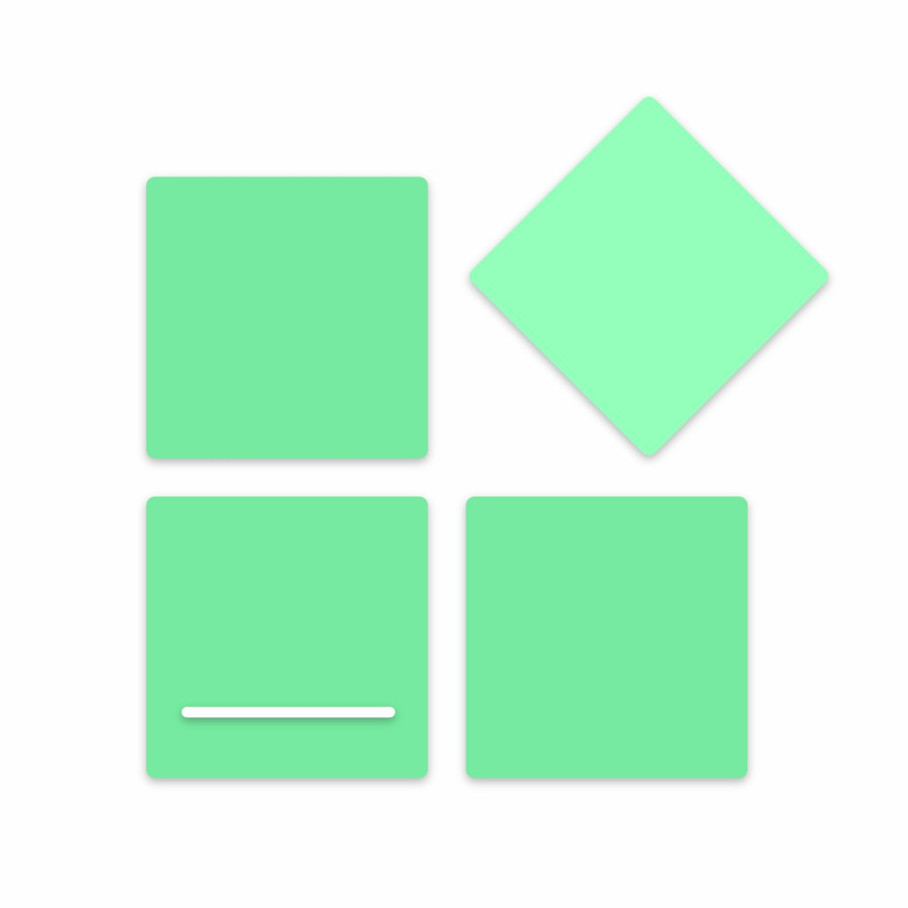

## <i class="fa-solid fa-calendar-days"></i> [课表类](/classschedule/index.md)

| 软件 | 组织/开发者 |
| - | - |
| [CsesWebEditor](/classschedule/cses.md) |   [`SmartTeachCN`](https://github.com/SmartTeachCN)  [`PYLXU`](https://github.com/PYLXU) |
|  [ClassIsland](/classschedule/classisland/index.md) |   [`ClassIsland`](https://github.com/ClassIsland)  [`HelloWRC`](https://github.com/HelloWRC) |
| [Class-Widgets](/classschedule/class-widgets/index.md) |  [`Class-Widgets`](https://github.com/Class-Widgets)  [`RinLit-233-shiroko`](https://github.com/RinLit-233-shiroko) |
| [LingYun-Class-Widgets](/classschedule/lingyun-class-widgets/index.md) |  [`Yamikani-Flipped`](https://github.com/Yamikani-Flipped) |
|  [ElectronClassSchedule](/classschedule/electronclassschedule/index.md) |  [`EnderWolf006`](https://github.com/EnderWolf006) |
|  [iClass](/classschedule/iclass/index.md) |  [`gpuawa`](https://github.com/gpuawa) |

## <i class="fa-solid fa-puzzle-piece"></i> [多功能类](/multi-function/index.md)

| 软件 | 组织/开发者 |
| - | - |
|  [Ris_ClassTool](/multi-function/ris_classtool/index.md) |  [`Ris-Soft`](https://github.com/Ris-Soft)  [`PYLXU`](https://github.com/PYLXU)|
|  [ZongziTEK黑板贴](/multi-function/zongzitek-blackboard-sticker/index.md) |  [`STBBRD`](https://github.com/STBBRD) |
|  [Education Clock](/multi-function/education-clock/index.md) |  [`Return-Log`](https://github.com/Return-Log) |

## <i class="fa-solid fa-chalkboard"></i> [看板类](/dashboard/index.md)

| 软件 | 组织/开发者 |
| - | - |
|  [ExamAware](/dashboard/examaware/index.md) |  [`ExamAware`](https://github.com/ExamAware)  [`Hello8693`](https://github.com/Hello8693) |
|  [Sticky-attention](/dashboard/sticky-attention/index.md) |  [`Sticky-attention`](https://github.com/Sticky-attention)  [`jizilin6732`](https://github.com/jizilin6732) |
|  [HomeworkBoard](/dashboard/homeworkboard/index.md) |  [`EnderWolf006`](https://github.com/EnderWolf006) |
|  [Classworks](/dashboard/classworks/index.md) |  [`ClassworksDev`](https://github.com/ClassworksDev)  [`SunWuyuan`](https://github.com/SunWuyuan) |
|  [ClassBoardSharp](/dashboard/classboardsharp/index.md) |  [`Candlest`](https://githhttps://github.com/Candlest) |
|  [LockTime](/dashboard/locktime/index.md) |  [`cjhdevact`](https://github.com/cjhdevact) |

## <i class="fa-solid fa-pen"></i> [批注类](/annotation/index.md)

| 软件 | 组织/开发者 |
| - | - |
|  [Ink-Canvas](/annotation/ink-canvas/index.md) |  [`WXRIW`](https://github.com/WXRIW) |
|  [Ink-Canvas-Plus](/annotation/ink-canvas-plus/index.md) |  [`clover-yan`](https://github.com/clover-yan/) |
|  [Ink-Canvas-Artistry](/annotation/ink-canvas-artistry/index.md) |  [`ChangSakura`](https://github.com/ChangSakura)  [`InkCanvas`](https://github.com/InkCanvas) |
|  [InkCanvasForClass](/annotation/inkcanvasforclass/index.md) |  [`InkCanvas`](https://github.com/InkCanvas) |
|  [SketchNow](/annotation/sketchnow/index.md) |  [`SketchNow`](https://github.com/SketchNow)  [`realybin`](https://github.com/realybin) |
|  [智绘教Inkeys](/annotation/inkeys/index.md) |  [`Alan-CRL`](https://github.com/Alan-CRL) |
|  [Inkways-Classic](/annotation/inkways-classic/index.md) |  [`iNKORE Studios`](https://github.com/iNKORE-NET) |
|  [LemonxNote](/annotation/lemonxnote/index.md) |  [`lh11117`](https://github.com/lh11117) |

## <i class="fa-solid fa-download"></i> [下载类](/downloader/index.md)

| 软件 | 组织/开发者 |
| - | - |
|  [SectionIstool](/downloader/sectionistool/index.md) |  [`SectionIstool`](https://github.com/SectionIstool)  [`lzy98276`](https://github.com/lzy98276) |
|  [SeewoHUB](/downloader/seewohub/index.md) |  [`CNwenwen`](https://github.com/CNwenwen) |

## <i class="fa-solid fa-cubes"></i> [杂类](/miscellany/index.md)

| 软件 | 组织/开发者 |
| - | - |
|  [NamePicker](/miscellany/namepicker/index.md) |  [`NamePicker`](https://github.com/NamePickerOrg)  [`LHGS-github`](https://github.com/LHGS-github) |
|  [Rand](/miscellany/rand/index.md) |  [`LuoYunXi0407`](https://github.com/LuoYunXi0407) |
|  [SecRandom](/miscellany/secrandom/index.md) |  [`lzy98276`](https://github.com/lzy98276) |