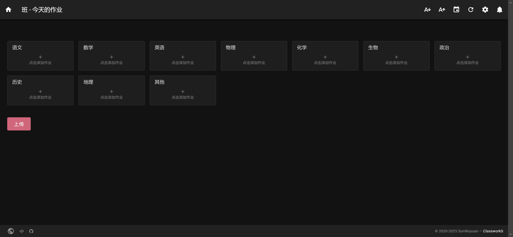
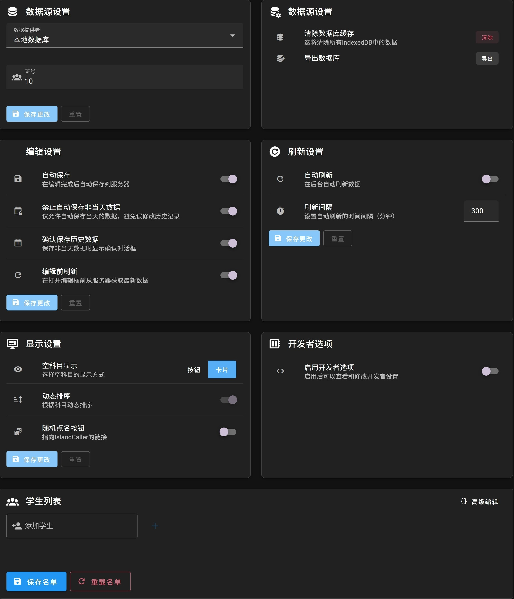
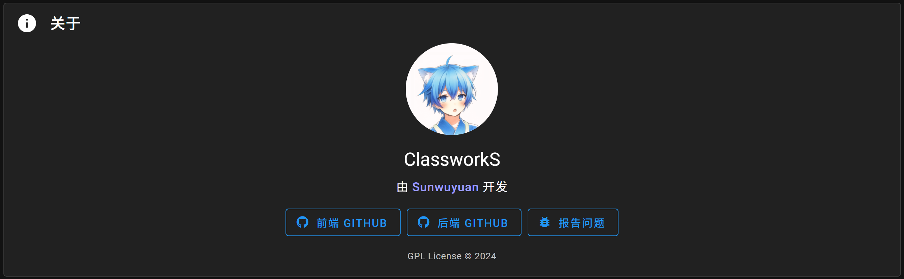

         

基于 Vue 3 + Vuetify 的现代化作业管理系统前端项目

GitHub仓库：[https://github.com/ClassworksDev/Classworks](https://github.com/ClassworksDev/Classworks)

<SiteInfo
  name="ZeroCat 官网"
  desc="新一代，开源，编程社区"
  url="https://zerocat.houlangs.com"
  logo="https://zerocat.houlangs.com/favicon.png"
  repo="https://github.com/ClassworksDev/Classworks"
  preview=""
/>

## ✨ 特性
- 🎯 TypeScript 支持
- 🎨 基于 Vuetify 3 的精美 UI
- 📱 响应式设计，完美适配多端
- ⚡️ Vite 提供的极速开发体验
- 🔑 完善的权限管理系统
- 🎉 丰富的组件和功能模块

