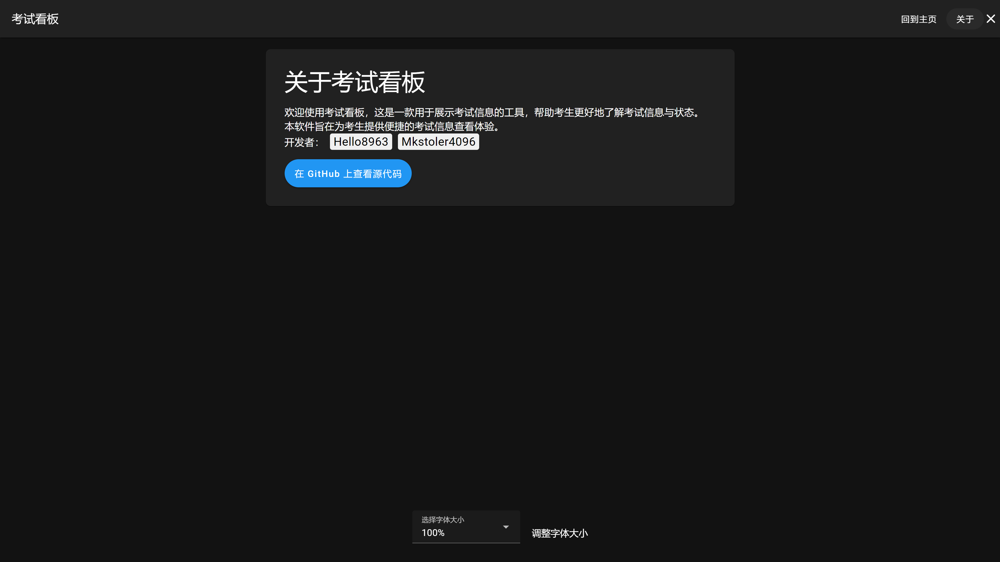

一款显示当前时间与考试详细信息的显示工具

GitHub仓库：[https://github.com/ExamAware/dsz-exam-showboard](https://github.com/ExamAware/dsz-exam-showboard)

#### 功能

- 起始页展示 `打开配置` 、 `直接进入看板` 按钮
- 看板页面
  - 上方展示 `考试标题` 、 `信息`
  - 左侧展示 `当前时间` 、 `当前科目` 、 `考试时间` 、 `考试状态`
  - 右侧展示考试科目列表，包括 `科目` 、 `开始` 、 `结束` 、 `状态`
  - 考试结束前15分钟黄字提醒
  - 集控功能（早期测试）
  - 设置页面（正在开发）
