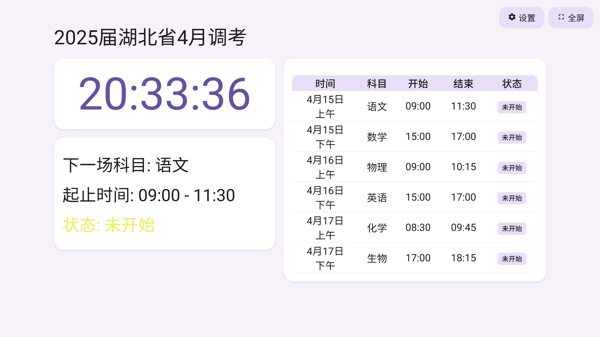
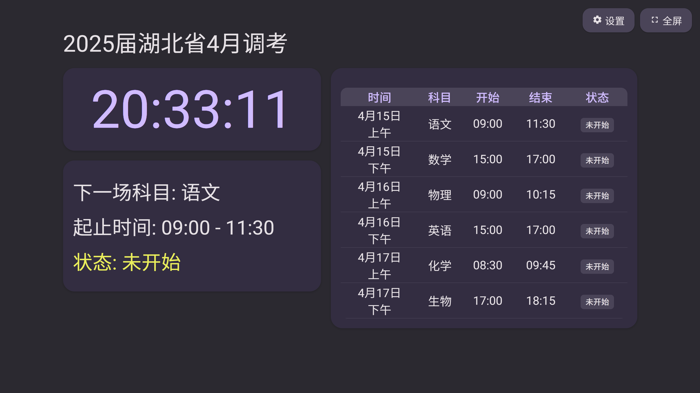

# ExamSchedule

**不只是考试看板**

[**在线体验**](https://es.examaware.tech/)

## 功能

- 当前时间
- 考试看板
  - 实时显示当前时间、当前考试科目、考试起止时间、剩余时间及考试状态
  - 支持全屏显示
  - 支持设置时间偏移和考场信息，并保存到浏览器 Cookie 中
  - 支持临时编辑消息，并保存到浏览器 Cookie 中（3天后到期）
- 考试广播
  - 支持自定义广播配置
  - 支持打开本地 json 配置
