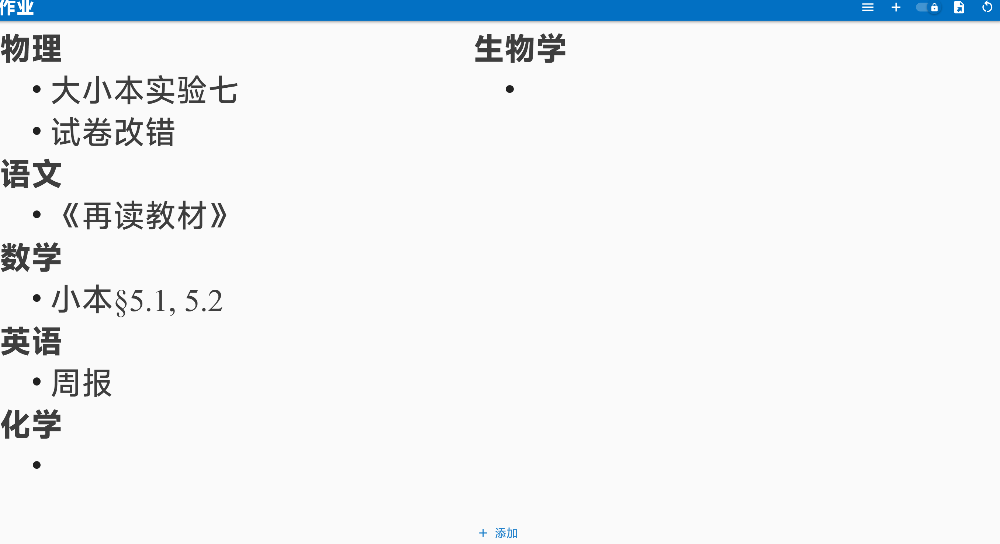
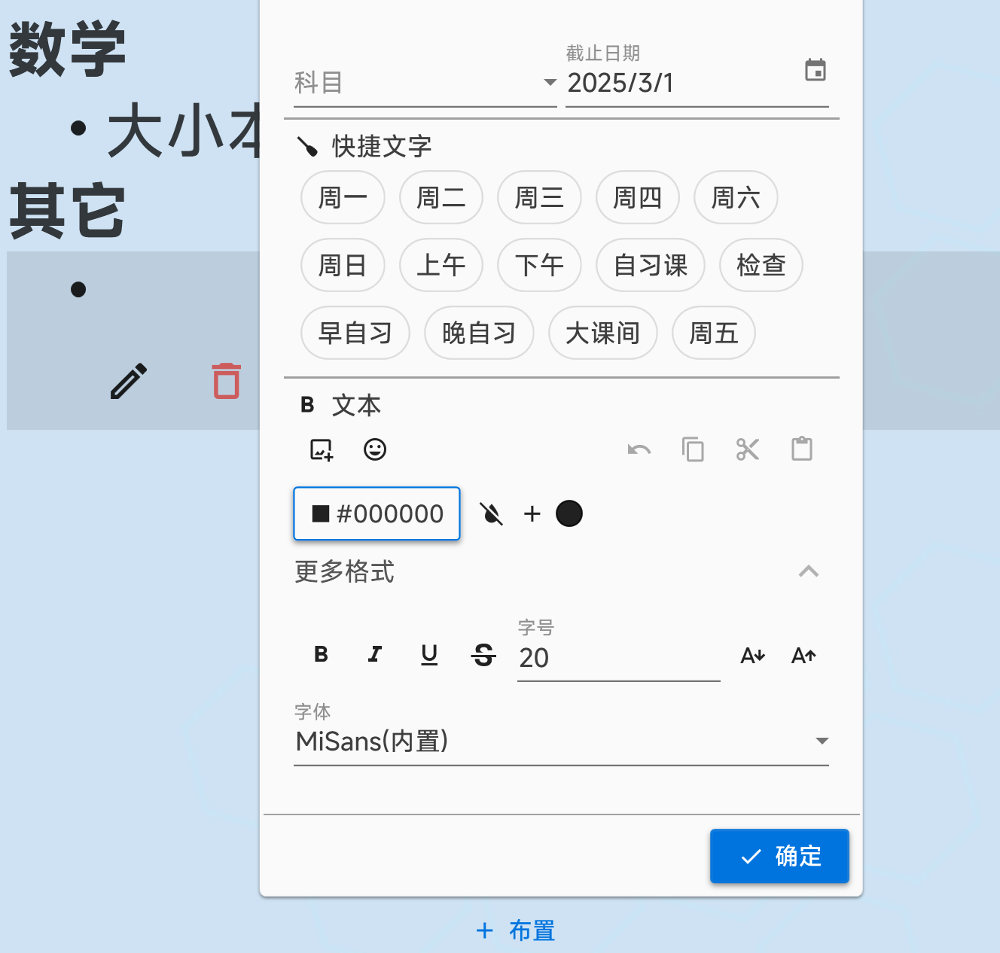
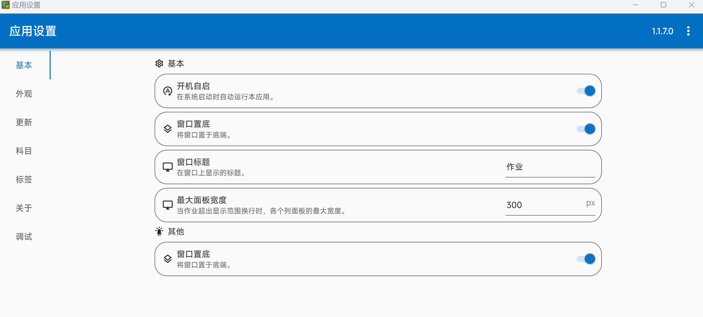

              

Sticky-attention 是一款适用于Windows 系统教室一体机的作业显示工具，可以展示各科作业等信息，后续将添加更多新内容。

GitHub仓库：[https://github.com/Sticky-attention/Sticky-attention](https://github.com/Sticky-attention/Sticky-attention)

<BiliBili bvid="BV1YJ4Fe5EgD" />

## 功能

- 布置与修改作业
- 富文本支持（字体及其大小、颜色等）
- 按科目分类，科目预设
- 为作业添加标签
- 主界面全局缩放
- 一键清理/恢复过期作业
- 导出作业面板截图
- 支持软件自动更新
- 界面圆角
- 插入图片、表情