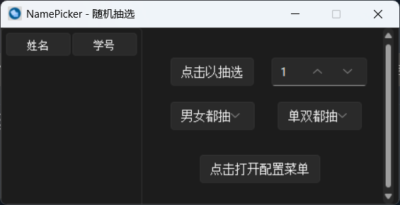
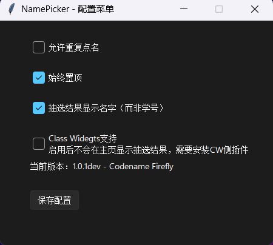

<div align="center">



[](https://github.com/NamePickerOrg/NamePicker) [](https://github.com/NamePickerOrg/NamePicker) [](https://github.com/NamePickerOrg/NamePicker/watchers) [](https://github.com/NamePickerOrg/NamePicker/releases/latest) [](https://github.com/NamePickerOrg/NamePicker/issues) [](https://github.com/NamePickerOrg/NamePicker/releases/latest)  [](https://github.com/NamePickerOrg/NamePicker) [](https://github.com/NamePickerOrg/NamePicker/commits/master)  [](https://github.com/NamePickerOrg/NamePicker/blob/master/LICENSE)

一款简洁的点名软件

GitHub仓库：[https://github.com/NamePickerOrg/NamePicker](https://github.com/NamePickerOrg/NamePicker)
NamePicker x Class-Widgets：[https://github.com/NamePickerOrg/NamePicker4CW](https://github.com/NamePickerOrg/NamePicker4CW)
</div>

## 功能
- [x] 随机抽取
- [x] 可视化配置菜单
  
- [x] 从外部读取名单
  - [在线名单编辑器](https://np-nameeditor.streamlit.app/)
  - [可视化名单编辑器](https://github.com/NamePickerOrg/NP-NameEditor)
  - 示例：（0=男，1=女）
    ```csv
    name,sex,no
    example,0,1
    ```
- [x] 特殊点名规则
- [x] 支持非二元性别
- [ ] 概率内定
- [ ] 悬浮窗（点击展开主界面）
- [ ] 软件内更新
- [ ] 同时抽选多个
